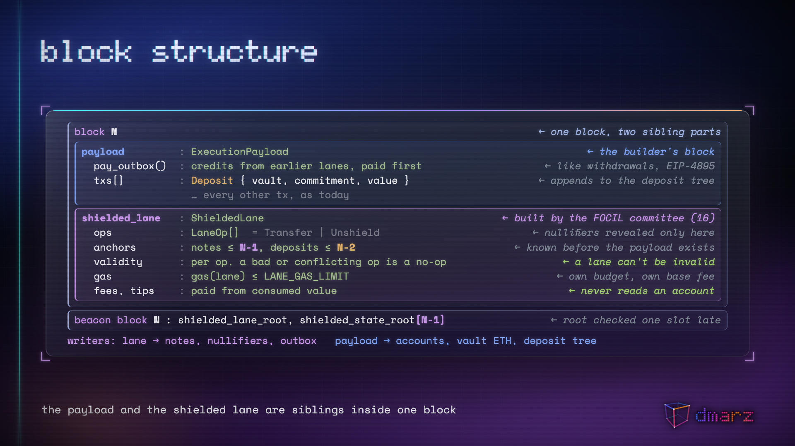
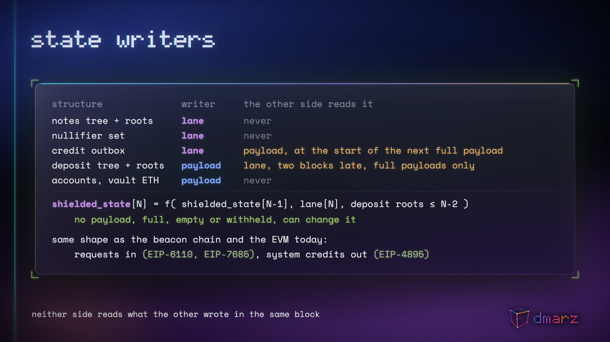
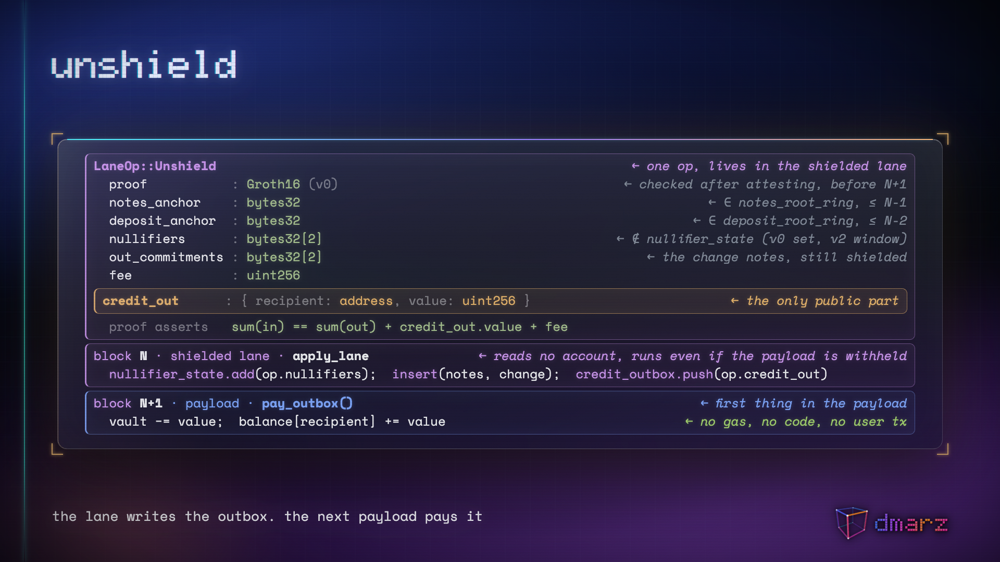
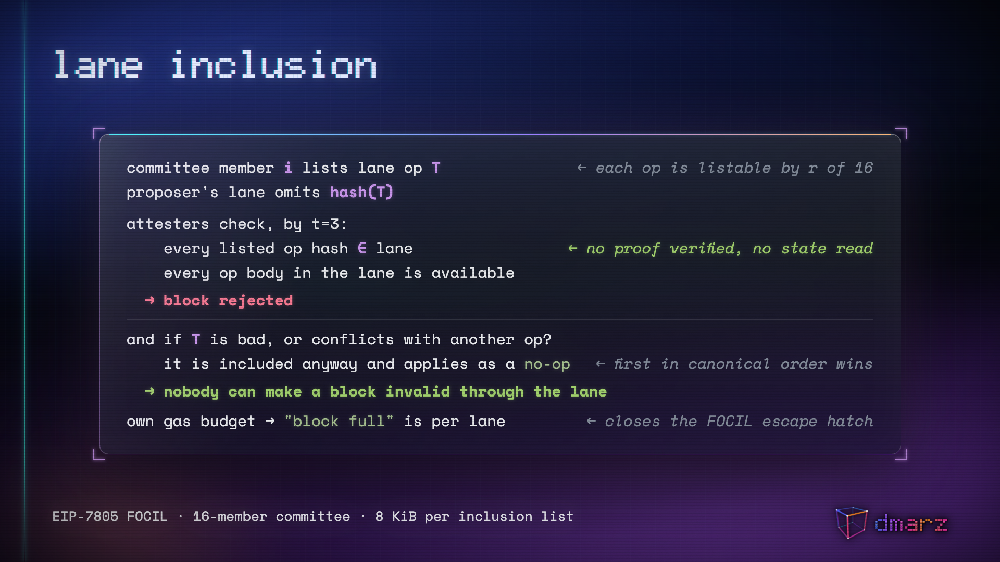
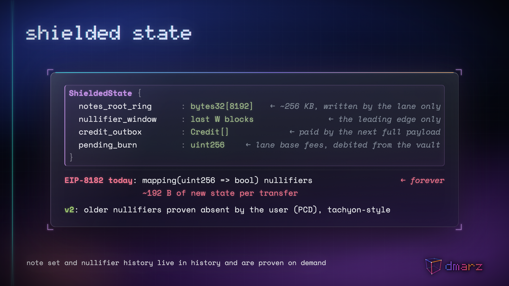
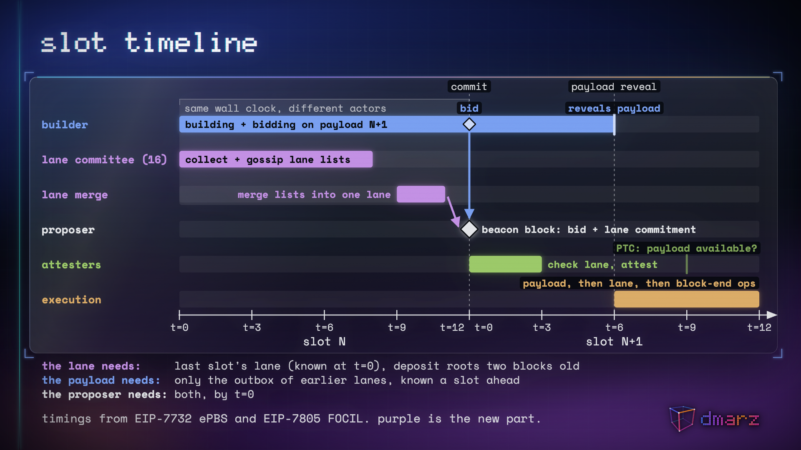

# Shielded Lane

**A committee-built private-transfer lane for Ethereum L1: Zcash-style shielded transfers, included FOCIL-style at the end of the block, with Tachyon-style prunable state and one aggregated proof per block.**

This repository is a live research dossier for an active protocol design. The README is the status board. Everything else in the repo is evidence, decisions, or draft spec. If you only read one file, read this one.

| | |
|---|---|
| **Status** | Research, draft spec v0.2. No code. No EIP number. Not yet reviewed by a client developer or a cryptographer. |
| **Origin** | 2026-09-17 hot take: "add zcash style private transfers which are included end of block FOCIL style with some fancy UTXO state and proof aggregation thing that doesn't require all nodes to sync the state." |
| **Maintainer** | [@dmarzzz](https://github.com/dmarzzz) · [@DistributedMarz](https://x.com/DistributedMarz) |
| **Repo** | https://github.com/dmarzzz/eth-shielded-lane |
| **Last dossier update** | 2026-09-19 |
| **Target** | Post-Hegotá (2027+), delivered as a sequence of EIPs ([ADR-0012](docs/decisions/ADR-0012-one-design-many-eips.md)). Stage 0 rides on FOCIL and frame transactions, both scheduled for Hegotá. |
| **License** | CC BY 4.0 |

---

## 1. Thesis

People trying to access the same state is what creates MEV. That is why builders exist. Ordering contentious state is a real skill with real economies of scale, and ePBS is Ethereum accepting that. With innovations like propAMM prioritization and JIT routing (Quintus's work at Flashbots), the builder's role will keep getting more important for improving a blockchain's ability to facilitate applications like exchanges. Contention is not a bug to be designed away. It is what a market looks like from the inside.

On their own, MCP and encrypted mempools are not bullish. They limit the market potential for markets built on top of Ethereum: split a contentious block across many proposers and the merge into one order becomes the new thing to game, which is where an out-of-protocol backrun market forms. Every published MCP design merges into one execution. It is a valid opinion to say let's not care about market efficiency for trading tokens and stocks on Ethereum in favor of decentralization. But then at that point let's give up the complexity and just do private transfers like Zcash.

The core insight: **MCP is amazing for something with low state contention**, because there is less incentive to build out-of-protocol markets to game MCP. A shielded transfer burns a nullifier only the spender holds, appends a commitment, and moves value inside a vault. Two shielded transfers can only conflict on a double spend. No ordering value, no MEV, no builder needed. MCP is free there and expensive everywhere else. And if we are talking low contention activity, then skip all the complexity and just do Zcash.

But what if we could do both? Do the regular full block through the builder mev-boost pathway (soon to be ePBS), and then create an end-of-block section for private transfers which cannot interact with the public lane state, and do MCP there. This way the "centralized" block builders focus on the high contention portion for people who are less concerned about getting censored, and the maximally "decentralized" validator network minimizes the chance of censorship for money. That is the design principle every decision in this repo applies ([ADR-0000](docs/decisions/ADR-0000-partition-by-contention.md)): **partition the block by contention.** The two lanes never depend on each other's contents. The only places MEV can appear are the crossings, and those are routed through the builder's lane on purpose.

How the private transfers work internally is the part to be humble about. The Zcash folks are giga cracked and Ethereum has its own proposals in flight (EIP-8182, Nero's native UTXOs, Tachyon's prunable state). This dossier picks a starting point and argues it, but the main design requirement is really this: **can you decouple the private and public state while still being able to transfer between the two.** Everything downstream, the anchor rule, the unshield path, the proof tiers, is a way of satisfying that one requirement.

Ethereum is about to ship the pieces: FOCIL and frame transactions in Hegotá, ePBS in Glamsterdam. EIP-8182 was proposed for Hegotá and declined on 2026-09-14. Zcash's Tachyon shows how the shielded side prunes and aggregates. This dossier is the composition.

## 2. The design in one screen

```
slot N
┌──────────────────────────────────────────────────────────────────────┐
│ beacon block (proposer, t=0)                                         │
│   ├─ builder payload hash            (ePBS bid, revealed later)      │
│   └─ shielded lane commitment        (committee-built, t=0..8s)      │
├──────────────────────────────────────────────────────────────────────┤
│ execution                                                            │
│   1. builder payload   : normal EVM txs                              │
│        - starts by paying the credit outbox (system op, no gas)      │
│        - deposits: ETH to the vault, commitment to the DEPOSIT tree  │
│   2. shielded lane     : appended, commutes with (1)                 │
│        - N shielded ops; notes anchor <= N-1, deposit anchor <= N-2  │
│        - fees paid from shielded value, no account reads             │
│        - per-op validity: a bad or conflicting op is a no-op         │
│        - outputs: notes, nullifiers, credits into the OUTBOX         │
│   3. block-end system ops                                            │
│        - seal notes root (lane) and deposit root (payload)           │
└──────────────────────────────────────────────────────────────────────┘

one writer per structure (ADR-0009):
   lane writes      : notes tree + root ring, nullifier set, credit outbox
   payload writes   : accounts (incl. the vault's ETH), deposit tree + root ring
   cross reads      : lane reads deposit roots >= 2 blocks old from FULL payloads
                      payload pays the outbox at the start of the next FULL payload
shielded state is its own domain, committed in the beacon state one slot late (ADR-0011).
v0 keeps every nullifier; v2 keeps a window.
```

What the lane committee is, and is not. It is FOCIL's committee: 16 validators chosen fresh each slot. Each one writes down the shielded transactions it has seen and gossips that list, so that no builder or proposer can quietly drop one. It does not anonymize anything. A shielded transfer is already private when it leaves the wallet: a proof, a nullifier, and a commitment, unreadable to everyone including the committee. The committee's job is inclusion, not privacy. Privacy comes from the transaction; censorship resistance comes from the committee.

Why the lane commutes with the payload:

- Lane transactions read only the root ring and the nullifier window. They write only appends.
- Fees are paid from shielded value (EIP-8182 fee note / Nero vault pattern). Tips, where present, are outbox credits to the proposer's fee recipient, paid with the other credits at the start of the next full payload. The lane never reads or writes an account.
- Anchor rule: lane transactions prove against notes roots as of the end of block N-1 or older, and deposit roots two blocks old or older (ADR-0009). The lane's pre-state is fully known at slot start, so the committee can build and prove it in parallel with the builder, and the proposer commits to both at t=0.
- Conflicts exist only among lane transactions (same nullifier) and against earlier lanes. Validity is per op: the first op in canonical order wins, a loser is a no-op, and a lane can never be invalid (ADR-0010). This is safe at v0 because 8182 proofs bind the note body and leaf positions are assigned at insert; v2 aggregation needs its own rule (OQ-3).

The only coupling is the two crossings:

| Crossing | Where it runs | How independence is kept |
|---|---|---|
| Deposit (public -> shielded) | payload tx pays into the vault and appends a commitment to the **deposit tree** | the payload is that tree's only writer; lanes read its roots two blocks late, so no payload outcome (full, empty, withheld) changes what a lane sees |
| Unshield (shielded -> public) | lane writes (recipient, value) to the **credit outbox** | the lane is the outbox's only writer; the next full payload must start by paying it, like validator withdrawals (EIP-4895). No second user transaction, nothing for a builder to censor |

Proof tiers (ship v0, grow into v2):

| Tier | Proofs verified per block | What it needs | State model |
|---|---|---|---|
| v0 | one Groth16 BN254 per tx, batch-verified natively in the lane | nothing new on the proof side | root ring + a permanent nullifier set (same state cost as EIP-8182; no pruning at v0) |
| v1 | one per committee member (16) | simple non-recursive aggregation | same |
| v2 | one aggregate for the whole lane | recursion a CL client can verify inside the attestation window; Tachyon-style nullifier derivation and note format | root ring + nullifier **window**; users carry PCD non-membership proofs (Tachyon). This is a note-format change, not only a state-model swap |

Full draft: [`docs/design/spec-draft.md`](docs/design/spec-draft.md).

## 2a. The design in pictures

| | |
|---|---|
|  |  |
| Block structure: the payload and the shielded lane are siblings inside one block | State writers: one writer per structure |
|  |  |
| Unshield, from op to system credit | Lane inclusion: checked by hash, validity per op |
|  |  |
| Shielded state: what a node keeps | Slot timeline: built in parallel, committed together |

Films: [explainer (33.5 s)](media/films/SL-Film.mp4) · [deposit](media/films/SL-DepositFlow.mp4) · [unshield](media/films/SL-UnshieldFlow.mp4)

In the explainer a block has three looks: clear glass while it fills, light green once it is proposed and attested, solid green once it is sealed.

## 3. Status board

| Workstream | Status | Notes |
|---|---|---|
| Problem statement and thesis | done | Section 1 |
| Primary-source survey (Tachyon, Nero UTXOs, FOCIL, EIP-8182, roadmap, MCP) | done | [`docs/research/`](docs/research/) |
| Two-lane block structure | drafted | [ADR-0002](docs/decisions/ADR-0002-two-lane-block.md) |
| Unshield path | decided (system credit from a lane-written outbox); the transparent-UTXO design is superseded | [ADR-0009](docs/decisions/ADR-0009-single-writer-state-and-mailboxes.md) |
| Slot timing / parallel build argument | decided | [ADR-0008](docs/decisions/ADR-0008-nullifiers-only-in-the-lane.md) |
| Proof system choice | v0 decided (Groth16 BN254), v2 open | [ADR-0005](docs/decisions/ADR-0005-proof-tiers.md), OQ-1 |
| Lane fee market | sketched | OQ-4 |
| Aggregator role and incentives | sketched | OQ-3 |
| Draft spec v0.2 | in progress | [`docs/design/spec-draft.md`](docs/design/spec-draft.md) |
| Separation of the two lanes (single-writer state, mailboxes) | decided | [ADR-0009](docs/decisions/ADR-0009-single-writer-state-and-mailboxes.md), [ADR-0010](docs/decisions/ADR-0010-per-op-validity.md), [ADR-0011](docs/decisions/ADR-0011-deferred-lane-root-and-state-domain.md) |
| Delivery path | decided: one design, staged across EIPs | [ADR-0012](docs/decisions/ADR-0012-one-design-many-eips.md) |
| Nullifier window sizing | not started | OQ-2 |
| Cost model (state, bandwidth, verify time) | not started | OQ-6 |
| Prototype (lane validity checker over a fork of an EL client) | not started | |
| Explainer film, two crossing animations, six spec figures | built | [`media/`](media/), sources in [`media/src/`](media/src/) |
| Launch-video quality research (references, craft, process) | done | [`docs/launch-video-quality.md`](docs/launch-video-quality.md) |
| Red team 1 (six simulated readings, 2026-09-17) | done, 19 objections, the fatal and serious ones addressed in spec | [`docs/redteam-2026-09-17.md`](docs/redteam-2026-09-17.md) |
| Red team 2 (crossings; consensus and alternatives, 2026-09-19) | done; drove ADR-0009 to ADR-0012 | [`docs/redteam-2026-09-19-crossings.md`](docs/redteam-2026-09-19-crossings.md), [`docs/redteam-2026-09-19-consensus-alternatives.md`](docs/redteam-2026-09-19-consensus-alternatives.md) |
| ethresear.ch post | not started | framing in Section 8 |
| EIP draft | not started | blocked on OQ-1, OQ-3 |

## 4. Design decisions

Each decision has an ADR under [`docs/decisions/`](docs/decisions/) with context, alternatives, and consequences.

| ADR | Decision | One-line why |
|---|---|---|
| [0000](docs/decisions/ADR-0000-partition-by-contention.md) | Partition the block by contention | MEV comes from contention; shielded transfers have none, so they need no builder and MCP is free for them; everything contended stays with builders |
| [0001](docs/decisions/ADR-0001-base-on-eip-8182.md) | Base pool semantics on EIP-8182 | Only shielded-pool proposal with a fork slot; its author concedes the state-growth gap this design fills |
| [0002](docs/decisions/ADR-0002-two-lane-block.md) | Two-lane block, not MCP-style merged execution | Every published MCP design merges bundles into one sequential execution, reintroducing state coupling |
| [0003](docs/decisions/ADR-0003-anchor-at-n-minus-1.md) | Lane anchors to roots as of block N-1 (the deposit drain in this ADR is superseded by 0009) | Makes the lane's pre-state known at slot start; enables parallel building under ePBS |
| [0004](docs/decisions/ADR-0004-unshield-via-transparent-utxo.md) | Superseded by 0009. Was: unshield into a transparent UTXO, not an account credit | Kept for the record of alternatives; the lane still writes zero account state |
| [0005](docs/decisions/ADR-0005-proof-tiers.md) | Ship v0 (per-tx Groth16, batch-verified), design for v2 (single aggregate + windowed nullifiers) | Buildable now on existing precompile assumptions; does not wait on Ragu or a new curve |
| [0006](docs/decisions/ADR-0006-fees-from-shielded-value.md) | Fees paid from shielded value, separate lane gas | Removes every account read from the lane; closes the FOCIL "block full" loophole |
| [0007](docs/decisions/ADR-0007-focil-enforcement.md) | FOCIL committee lists lane txs; attesters reject a lane missing any listed tx | Reuses the Hegotá mechanism; "valid if appended" is trivial because the lane commutes |
| [0008](docs/decisions/ADR-0008-nullifiers-only-in-the-lane.md) | Nullifier reveals only in the lane; no inline shielded spends in the payload | Makes the lane's pre-state known at t=0 of the previous slot, so committee and builder work in parallel and attesters check the lane by t=3 |
| [0009](docs/decisions/ADR-0009-single-writer-state-and-mailboxes.md) | One writer per structure; deposits get their own tree; unshields are system credits from an outbox | Makes "no overlap" literally true, gives a one-block respend, removes the claim transaction and the UTXO and frames dependencies. Supersedes the drain in 0003 and the UTXO in 0004 |
| [0010](docs/decisions/ADR-0010-per-op-validity.md) | Validity is per op; a lane cannot be invalid; inclusion is checked by hash | One user with one note could make every block invalid under the old rules; this also takes SNARK verification off the attestation path |
| [0011](docs/decisions/ADR-0011-deferred-lane-root-and-state-domain.md) | Lane root verified one slot late; shielded state is its own domain committed in the beacon state | Makes "the lane survives a withheld payload" true, using the same deferral ePBS applies to payloads |
| [0012](docs/decisions/ADR-0012-one-design-many-eips.md) | One design, delivered as a sequence of EIPs (pool on frames, IL gas carve-out, mailboxes and state domain, the lane, v2) | The fork declined the one-EIP version of a smaller idea; each stage is useful alone and stage 0 needs nothing new |

## 5. Open questions

Status values: `open`, `researching`, `answered`, `deferred`. An answered question moves its resolution into an ADR.

| ID | Question | Status | What resolves it |
|---|---|---|---|
| OQ-1 | Which recursive proof system for v2? Tachyon's Ragu is Halo/IPA over Pasta; the EVM only has BN254 pairing precompiles. Candidates: PCD on the bn254/grumpkin cycle with a Groth16 wrap; hash-based recursion (WHIR/STIR) with native client verification; a new precompile. | open | Benchmarks of one aggregate over ~1k txs inside a builder window; Ragu benchmarks when published |
| OQ-2 | Nullifier window size W. Too small and honest users with stale PCD get rejected; too large and the pruning win shrinks. Nero uses an 8192-block ring for roots. | open | Model of PCD refresh latency vs. W; oblivious-sync service assumptions |
| OQ-3 | Who aggregates (v1/v2 only; at v0 the lane is the deterministic union of committee lists and needs no aggregator) and how are they paid? Equivocation and withholding cases. The t=9..11 window is two seconds; no aggregation benchmark exists. | researching | Incentive analysis borrowing from FOCIL fee options and the duplication-penalizing TFM in the MCP literature |
| OQ-4 | Lane fee market. Own base fee like blob gas? Fixed price per tx shape? How does base-fee burn from shielded value work? | open | Spec section + simple simulation |
| OQ-5 | Deposit bounds. The queue is gone (ADR-0009), but deposits still need a minimum value, a per-block cap and an excess fee, as EIP-7002 and EIP-7251 do for their queues. Is a two-block deposit delay acceptable? | open | Pick constants; measure deposit gas |
| OQ-6 | Cost model: consensus state, per-block bandwidth for the lane, attester verify time at v0 (batch Groth16) and v2. | open | Spreadsheet with sourced constants |
| OQ-7 | Inline mode. Should 8182-style transact remain allowed in the payload for atomic unshield-act-reshield, given it reveals nullifiers outside the lane? | answered | No. [ADR-0008](docs/decisions/ADR-0008-nullifiers-only-in-the-lane.md): nullifiers only in the lane, which is what makes parallel building and t=0..3 attestation work |
| OQ-8 | PCD custody. Both Nero and Tachyon move data custody to the user. Tachyon answers with oblivious sync services. Who runs those on Ethereum and why? | open | Service model + incentives; wallet-side design |
| OQ-9 | History expiry (EIP-4444). Old note leaves, deposit leaves and roots must stay provable after block bodies are pruned. Nero's answer for openings is "kept around." Need the sealing invariant CPerezz asked for, for both trees. | open | Specify batch sealing schedule and retention |
| OQ-10 | Post-quantum path. EIP-8182 plans a verifier swap. Pierre's post argues hash-based from day one. Does v2's choice foreclose either? | deferred | Track OQ-1 |
| OQ-11 | ERC-20 in the lane. 8182 supports it with a per-note token field; Nero's token proofs were found incomplete on-thread. | deferred | After v0 spec for ETH |
| OQ-12 | Compliance hooks. 8182 punts to companion standards; Privacy Pools association proofs could ride on the unshield entry. | deferred | Companion doc |
| OQ-13 | Reorgs. Pre-signed lane txs die if the creation block is re-indexed (Nero thread). Does anchoring to N-1 plus the ring make this tolerable? | open | Analysis |
| OQ-15 | Attester verification budget. "Valid if appended" for a listed-but-omitted lane tx means verifying its proof. Bound: 16 lists × 8 KiB ≈ at most ~128 Groth16 proofs per slot, batch-verified. Needs a measured number and a rule that committee members verify before listing (their lists are signed, so garbage is attributable). | open | Benchmark batch verification on a CL client; specify lister duties |
| OQ-16 | Lane-specific inclusion list. Lane ops carry proofs (~1 KB each) and do not fit EIP-7805's 8 KiB lists alongside normal txs. Needs a lane list topic and byte budget as an EIP-7805 amendment. | open | Draft the amendment |
| OQ-14 | Political path after the EIP-8182 decline. | answered | [ADR-0012](docs/decisions/ADR-0012-one-design-many-eips.md): one target design, delivered as a sequence of EIPs. Stage 0 is a pool on the already-scheduled frames path; the note format is fixed there so the anonymity set carries across stages |
| OQ-17 | Does an end-of-block private lane change builder economics at all (fee flow, bid values, timing games), or is it truly orthogonal? Needs a builder's view. | open | Conversation with an active builder team; model of lane fee flow against payload bid values |
| OQ-18 | Lister redundancy `r` (ADR-0010). Each op is listable by `r` of 16 members: censorship resistance is 1-of-`r`, throughput is 16/`r` lists, grief amplification is `r`. Initial value 3. | open | Model against realistic committee honesty; compare with FOCIL's 1-of-16 |
| OQ-19 | Network-layer privacy of lane gossip. Lane ops are private in content but gossiped in the open, on a low-volume topic with no sender field, so first-seen origin and the RPC that serves Merkle paths are the identity leaks (crossings red team, finding 8). Candidates: Dandelion-style stem relay on the lane topic, submission over Tor or a mixnet, PIR for path fetches. | open | Pick a default wallet submission path; measure topic volume needed for cover |

## 6. Ethereum roadmap dependencies

| EIP / track | Fork | Status (2026-09) | Why it matters here |
|---|---|---|---|
| EIP-7805 FOCIL | Hegotá (2027) | SFI (EIP-8081) | the committee and the enforcement rule |
| EIP-7732 ePBS | Glamsterdam (Q4 2026) | headliner, devnets | lets the proposer commit to the lane at t=0 without the payload |
| EIP-7928 Block-level access lists | Glamsterdam | headliner | formal way to declare the lane's access set as only the shielded system contract |
| EIP-8141 Frame transactions | Hegotá | SFI (EIP-8081) | no longer a dependency after ADR-0009; it is the base of the path the fork chose for privacy (frames + 8250 + 8272) |
| EIP-8182 Private ETH and ERC-20 transfers | none | **Declined for Hegotá on 2026-09-14** (EIP-8081, "DFI decisions from ACDE245") | pool semantics; the base this design extends. The decline is the main political fact for OQ-14 |
| EIP-8250 Keyed nonces | Hegotá | PFI | unlinkable parallel spends from one account |
| EIP-8272 Recent roots for frames | Hegotá | PFI | a VERIFY-frame pattern for checking roots before account validation |
| EIP-7503 ZK Wormholes | none | stagnant | precedent for a native mint via a new tx type |
| EIP-7886 Delayed execution | none | stagnant | conceptual model: validity without execution |
| EIP-4444 history expiry | rolling | in progress | OQ-9 |
| The Verge / EIP-8025 | roadmap | research | the lane is a closed subsystem, a natural first target for validity proofs |

## 7. Prior art and sources

Primary-source notes with verbatim quotes live in [`docs/research/`](docs/research/). Full link list in [`docs/bibliography.md`](docs/bibliography.md).

The five sources the design combines:

- Tachyon: https://seanbowe.com/blog/tachyon-scaling-zcash-oblivious-synchronization/
- New forms of state: https://ethresear.ch/t/hyper-scaling-state-by-creating-new-forms-of-state/24052
- Native UTXOs: https://ethresear.ch/t/native-utxos-on-ethereum/25368
- FOCIL (EIP-7805): https://eips.ethereum.org/EIPS/eip-7805
- EIP-8182: https://eips.ethereum.org/EIPS/eip-8182
- ePBS (EIP-7732): https://eips.ethereum.org/EIPS/eip-7732
- Hegotá inclusion status (EIP-8081): https://eips.ethereum.org/EIPS/eip-8081

- **Zcash Tachyon**: Sean Bowe's two posts (2025-04, 2025-05), the tachyon.z.cash overview and roadmap, the Ragu post (2026-05), and Bowe's forum statement on windowed nullifiers (2025-11). Notes: [`docs/research/01-zcash-tachyon.md`](docs/research/01-zcash-tachyon.md)
- **Hyper-scaling state by creating new forms of state** (vbuterin, ethresear.ch 24052, 2026-02). The state class the notes model belongs to: records go straight into history, state keeps only a spent fact. Native UTXOs is its concrete form.
- **Native UTXOs on Ethereum** (Nero_eth, ethresear.ch, 2026-07) and the thread critiques. Notes: [`docs/research/02-native-utxos.md`](docs/research/02-native-utxos.md)
- **FOCIL** (ethresear.ch 2024-06, EIP-7805, CL/EL workflow post, Hegotá selection). Notes: [`docs/research/03-focil.md`](docs/research/03-focil.md)
- **EIP-8182** and its magicians thread. Notes: [`docs/research/04-eip-8182.md`](docs/research/04-eip-8182.md)
- **Ethereum privacy and block-pipeline roadmap** (ethereum.org privacy roadmap, Vitalik's maximally simple L1 privacy roadmap, PSE, Pierre's PQ private ETH, EIP-7503, EIP-7886, EIP-7928, Scourge/Verge). Notes: [`docs/research/05-ethereum-roadmap.md`](docs/research/05-ethereum-roadmap.md)
- **Multiple concurrent proposers** (Multiplicity, Neuder/Resnick, BRAID, a16z "MCP: Why and How", "Price of Censorship", "MEV in MCP"). Notes: [`docs/research/06-mcp.md`](docs/research/06-mcp.md)

## 8. Framing for the first public post

"A shielded lane for Ethereum: committee-built, appended, commutative with the payload, verified natively, consensus state equals a root ring plus a nullifier window." Cite EIP-8182's author on unprunable nullifier data and the unanswered aggregation question on that thread. Ship v0 on Groth16 BN254 so it is buildable today; describe v2 as the Tachyon path.

## 9. Repo map

```
README.md                      this status board
docs/design/spec-draft.md      draft spec v0.2 (normative language where decided)
docs/decisions/ADR-*.md        design decisions with alternatives
docs/research/0*-*.md          primary-source notes, verbatim quotes, dates
docs/research/video/           launch-video research: references, craft, process
docs/launch-video-quality.md   synthesis: what launch grade means, our film scored
docs/redteam-*.md              simulated adversarial reviews and what they changed
docs/bibliography.md           every URL used, grouped
media/figures/                 spec figures used in the public thread (PNG)
media/films/                   explainer film and the two crossing animations (MP4)
media/src/                     Remotion sources for every figure and film
CHANGELOG.md                   dated dossier changes
```

## 10. How to update this dossier

- A new fact goes into the relevant `docs/research/` note with a date and a quote or link. Never paraphrase a load-bearing claim without the source.
- A new decision gets an ADR. Update the table in Section 4 and move any answered OQ to `answered` with a pointer.
- A new question gets the next OQ number. Do not renumber.
- Every change gets a line in `CHANGELOG.md` and bumps "Last dossier update" above.
- Inferences are labeled as such. This dossier separates "what the sources say" from "what we think follows."

## 11. Changelog

See [`CHANGELOG.md`](CHANGELOG.md).
